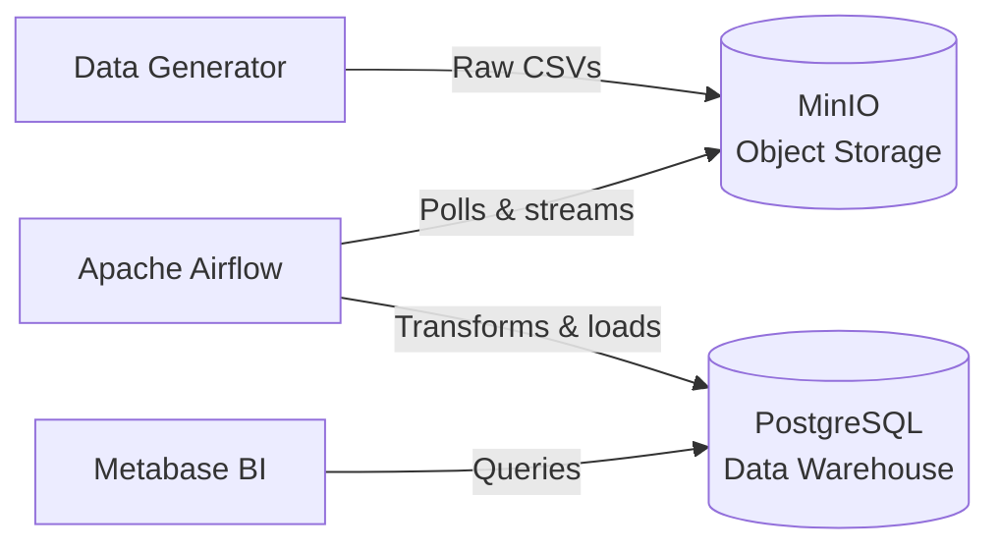

<div align="center">

# E-Commerce Sales Data Platform

**A production-ready, containerised data engineering platform for end-to-end sales analytics.**

[](https://github.com/DE-E-K/DEM12/actions/workflows/ci.yml)
[](https://github.com/DE-E-K/DEM12/actions/workflows/cd.yml)

*Synthetic e-commerce data flows through a fully automated pipeline:*  
**Data Generator → MinIO → Apache Airflow → PostgreSQL → Metabase**

</div>

---

## Table of Contents

- [Overview](#overview)
- [Architecture](#architecture)
- [Technology Stack](#technology-stack)
- [Services & Ports](#services--ports)
- [Database Schema](#database-schema)
- [Getting Started](#getting-started)
- [Running Tests](#running-tests)
- [CI/CD Pipeline](#cicd-pipeline)
- [Project Structure](#project-structure)
- [Troubleshooting](#troubleshooting)

---

## Overview

This platform demonstrates a complete data engineering workflow for an e-commerce business. It generates realistic synthetic sales data, ingests it through an orchestrated ETL pipeline, stores it in a normalised relational database, and exposes it via a self-service BI tool all running in Docker with a single `docker compose up`.

**Key capabilities:**

- **Automated data generation**: customers, products and transaction CSVs via Python/Faker (default: 1 k customers, 100 products, 10 k transactions)
- **Object storage**: CSVs land in MinIO (S3-compatible) before processing
- **Orchestrated ETL**: Airflow DAG runs every 15 minutes: download → validate → transform → load → archive
- **Normalised schema**: 7-table PostgreSQL database with foreign keys, computed columns, check constraints and indexes
- **Self-service analytics**: Metabase connects directly to PostgreSQL; the `Sales Overview` dashboard is provisioned automatically on first boot
- **Full CI/CD**: GitHub Actions workflows for linting, testing, building and deploying

---

## Architecture



> Full architecture diagrams (container layout, sequence flow, data model) are in [`docs/architecture.md`](docs/architecture.md).

---

## Technology Stack

| Component          | Technology               | Version   | Purpose                                    |
|--------------------|--------------------------|-----------|--------------------------------------------|
| Orchestration      | Apache Airflow           | 2.9.1     | DAG scheduling, task execution, monitoring  |
| Object Storage     | MinIO                    | latest    | S3-compatible storage for raw & archived CSVs |
| Database           | PostgreSQL               | 16-alpine | Normalised relational storage (7 tables)   |
| BI / Dashboards    | Metabase                 | latest    | Self-service analytics and visualisation    |
| Data Generator     | Python / Faker / Pandas  | 3.11      | Synthetic customer, product, and sales data |
| Infrastructure     | Docker Compose           | V2        | Multi-container orchestration               |
| CI/CD              | GitHub Actions           | —         | Automated testing, building, and deployment |
| Configuration      | Pydantic Settings        | 2.x       | Type-safe, validated environment variables  |


## Services & Ports

| Service           | Container                    | URL                         | Credentials              |
|-------------------|------------------------------|-----------------------------|--------------------------|
| Airflow UI        | `platform_airflow_webserver` | http://localhost:8080       | `admin` / see `.env`     |
| MinIO Console     | `platform_minio`             | http://localhost:9001       | `minioadmin` / see `.env`|
| MinIO S3 API      | `platform_minio`             | http://localhost:9000       | —                        |
| PostgreSQL        | `platform_postgres`          | `localhost:5432`            | `sales_user` / see `.env`|
| Metabase          | `platform_metabase`          | http://localhost:3000       | see `.env` (`MB_ADMIN_*`)|

> Credentials are configured in `.env`. Copy `.env.example` as a starting point — all variable names and descriptions are documented there.


## Database Schema

The `sales` database contains **7 normalised tables** with enforced foreign keys, check constraints, computed columns, and strategic indexes.

### Entity-Relationship Diagram


### Table Summary

| Table                | Type        | Rows (typical) | Description                                                 |
|----------------------|-------------|----------------|-------------------------------------------------------------|
| `product_categories` | Dimension   | 5              | Category lookup (Electronics, Apparel, Home & Kitchen, Books, Sports) |
| `products`           | Dimension   | 100            | Product catalog with pricing; `margin` is a generated column |
| `customers`          | Dimension   | 2,000          | Customer profiles with region and lifetime value             |
| `orders`             | Fact        | 10,000         | Sales transactions; `total_revenue` is a generated column    |
| `returned_orders`    | Fact        | ~2,500         | Return/refund tracking with `ON DELETE CASCADE` to orders    |
| `purchased_products` | Aggregation | 100            | Per-product revenue summaries, refreshed each pipeline run   |
| `pipeline_runs`      | Audit       | per run        | ETL execution log with row counts and status                 |

### Key Constraints

- **Foreign keys** enforce referential integrity across all related tables
- **Check constraints** on `quantity > 0`, `unit_price >= 0`, `discount BETWEEN 0 AND 1`, `refund_amount >= 0`
- **Generated columns**: `products.margin` = `unit_price - cost`; `orders.total_revenue` = `quantity × unit_price × (1 - discount)`
- **Indexes** on all foreign keys, date columns, and frequently filtered columns (`region`, `status`)


## Getting Started

### Prerequisites

| Requirement               | Minimum Version |
|---------------------------|-----------------|
| Docker Desktop            | ≥ 24.0          |
| Docker Compose            | V2              |
| Git                       | any             |
| Python *(optional, for Fernet key generation)* | ≥ 3.8 |

### Step 1: Clone & Configure

```bash
git clone https://github.com/DE-E-K/DEM12.git
cd DEM12
cp .env.example .env
```

Open `.env` and replace **all** `change_me_*` placeholder values with secure passwords.

### Step 2: Generate a Fernet Key for Airflow

```bash
python3 -c "from cryptography.fernet import Fernet; print(Fernet.generate_key().decode())"
```

Paste the output into `AIRFLOW__CORE__FERNET_KEY` in your `.env` file.

> **Tip:** If you don't have `cryptography` installed locally, run
> `pip install cryptography` first, or use any online Fernet key generator.

### Step 3: Start the Platform

```bash
docker compose up -d
```

Wait approximately 90 seconds for all health checks to pass, then verify:

```bash
docker compose ps
```

All services should report **healthy** status.

### Step 4: Generate Sample Data

```bash
docker compose --profile tools run --rm data-generator
```

This generates three synthetic CSV files and uploads them to the MinIO `raw-data` bucket.

### Step 5: Trigger the ETL Pipeline

**Option A: Via Airflow UI:**

1. Open http://localhost:8080
2. Log in with your configured admin credentials
3. Unpause the `sales_pipeline_dag` toggle (if paused)
4. Click **Trigger DAG** and watch all 6 tasks turn green

**Option B: Via CLI:**

```bash
docker exec platform_airflow_webserver airflow dags unpause sales_pipeline_dag
docker exec platform_airflow_webserver airflow dags trigger sales_pipeline_dag
```

### Step 6: Verify Data

```bash
docker exec platform_postgres psql -U sales_user -d sales \
  -c "SELECT 'product_categories' AS tbl, COUNT(*) FROM product_categories
      UNION ALL SELECT 'products', COUNT(*) FROM products
      UNION ALL SELECT 'customers', COUNT(*) FROM customers
      UNION ALL SELECT 'orders', COUNT(*) FROM orders
      UNION ALL SELECT 'returned_orders', COUNT(*) FROM returned_orders
      UNION ALL SELECT 'purchased_products', COUNT(*) FROM purchased_products
      UNION ALL SELECT 'pipeline_runs', COUNT(*) FROM pipeline_runs
      ORDER BY tbl;"
```

### Step 7: Explore Dashboards

Open Metabase at http://localhost:3000 the **Sales Overview** dashboard is pre-configured and ready to use. Log in with the `MB_ADMIN_EMAIL` / `MB_ADMIN_PASSWORD` from your `.env`.

> A public read-only link is also printed by the `metabase-init` container during first boot. Run `docker compose logs metabase-init | grep public` to retrieve it.

### Stopping the Platform

```bash
docker compose down          # Stop all containers (preserves data)
docker compose down -v       # Stop and remove all data volumes
```


## Running Tests

### Unit Tests (No Docker Required)

```bash
pip install pytest pandas pyarrow psycopg2-binary pydantic pydantic-settings
pytest tests/ -v --ignore=tests/test_data_flow.py
```

### End-to-End Data Flow Tests

Requires the full stack running with seeded data and at least one completed DAG run:

```bash
pytest tests/test_data_flow.py -v
```

---

## CI/CD Pipeline

Three GitHub Actions workflows automate quality gates and deployment:

| Workflow                     | File                         | Trigger        | Steps                                                  |
|------------------------------|------------------------------|----------------|--------------------------------------------------------|
| **Continuous Integration**   | `ci.yml`                     | Push / PR      | Compose lint → Build images → Unit tests → DAG import check |
| **Continuous Deployment**    | `cd.yml`                     | Merge to `main`| Build & push to Docker Hub → Deploy → Health checks    |
| **Data Flow Validation**     | `data-flow-validation.yml`   | Merge to `main`| Seed data → Trigger DAG → Assert DB rows via pytest    |

### Required GitHub Secrets

Configure the following secrets in your repository settings (**Settings → Secrets and variables → Actions**):

| Secret                   | Description                                 |
|--------------------------|---------------------------------------------|
| `POSTGRES_PASSWORD`      | PostgreSQL superuser password               |
| `AIRFLOW_DB_PASSWORD`    | Airflow metadata DB password                |
| `AIRFLOW_FERNET_KEY`     | 32-byte base64 Fernet encryption key        |
| `AIRFLOW_SECRET_KEY`     | Airflow webserver Flask session secret       |
| `AIRFLOW_ADMIN_PASSWORD` | Airflow web UI admin password               |
| `MINIO_PASSWORD`         | MinIO root password                         |
| `METABASE_DB_PASSWORD`   | Metabase PostgreSQL user password           |
| `DOCKERHUB_USERNAME`     | Docker Hub username                         |
| `DOCKERHUB_TOKEN`        | Docker Hub access token                     |


## Project Structure

```
DEM12/
├── .github/
│   └── workflows/
│       ├── ci.yml                      # CI checks (Lint, Docker build, Pytest) 
│       ├── cd.yml                      # CD deploy rules 
│       └── data-flow-validation.yml    # E2E test launching Airflow DAG and asserting DB counts
│
├── dags/
│   └── sales_pipeline_dag.py           # Core ETL Pipeline with streaming and intelligent batching
│
├── data-generator/
│   ├── build/                          # Auto-generated CSVs landing zone
│   ├── config.py                       # Pydantic base configuration
│   └── generate_data.py                # Faker script producing products, customers, and transactions
│
├── docs/                               # All Markdown guides and Mermaid diagrams
│   ├── architecture.md                 # Professional System Architecture diagrams
│   └── dashboards.md                   # Exact Metabase dashboard queries
│
├── include/                            # Shared Python functionality
│   ├── config.py                       # Global platform settings
│   ├── db_loader.py                    # psycopg2 batch up-serter & quality logger
│   └── transformations.py              # pandas transformations and business validations
│
├── init-scripts/                       # Postgres initialisation
│   ├── 00_init_users.sh                # Creates roles, grants and citext extension
│   └── 01_schema.sql                   # Normalised 7-table DB schema
│
├── metabase-init/
│   └── metabase_setup.sh               # Auto-provisions admin, DB connection and Sales Overview dashboard
│
├── minio-init/
│   └── create_buckets.sh               # Creates `raw-data`, `processed-data`, `invalid-data` buckets
│
├── tests/
│   └── test_data_flow.py               # 15+ end-to-end assert tests
│
├── docker-compose.yml                  # Local environment manifest (Airflow, Metabase, Postgres, MinIO)
├── airflow-requirements.txt            # Custom Airflow dependency injector
└── .env.example                        # Secure Vault Template
```

---

## Troubleshooting

| Issue | Cause | Solution |
|-------|-------|----------|
| `permission denied for schema public` | PostgreSQL 15+ revoked default CREATE on public schema | Already handled by `00_init_users.sh` — grants are applied automatically |
| `$'\r': command not found` in init containers | Windows CRLF line endings in shell scripts | Convert `.sh` and `.sql` files to LF: `git config core.autocrlf input` |
| Airflow tasks fail with `ModuleNotFoundError` | Missing Python packages in Airflow container | Packages are installed via `_PIP_ADDITIONAL_REQUIREMENTS` in `docker-compose.yml` |
| MinIO connection refused | MinIO not healthy yet | Wait for health check to pass: `docker compose ps` |
| Password authentication failed (external client) | Incorrect password or special character escaping | Enter password in a GUI field (not URL); verify with `docker exec platform_postgres psql -U sales_user -d sales` |
| Data generator produces old single-CSV output | Stale Docker image | Rebuild: `docker compose build --no-cache data-generator` |

---

## License

This project is developed for educational and demonstration purposes as part of the Data Engineering Specialisation program.
