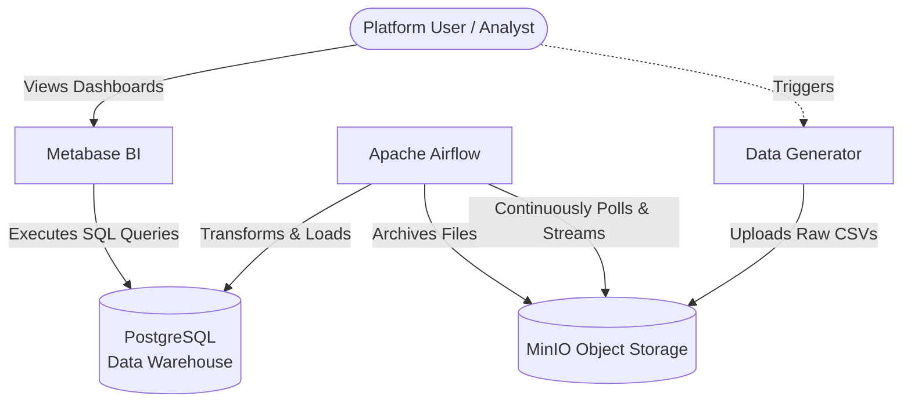
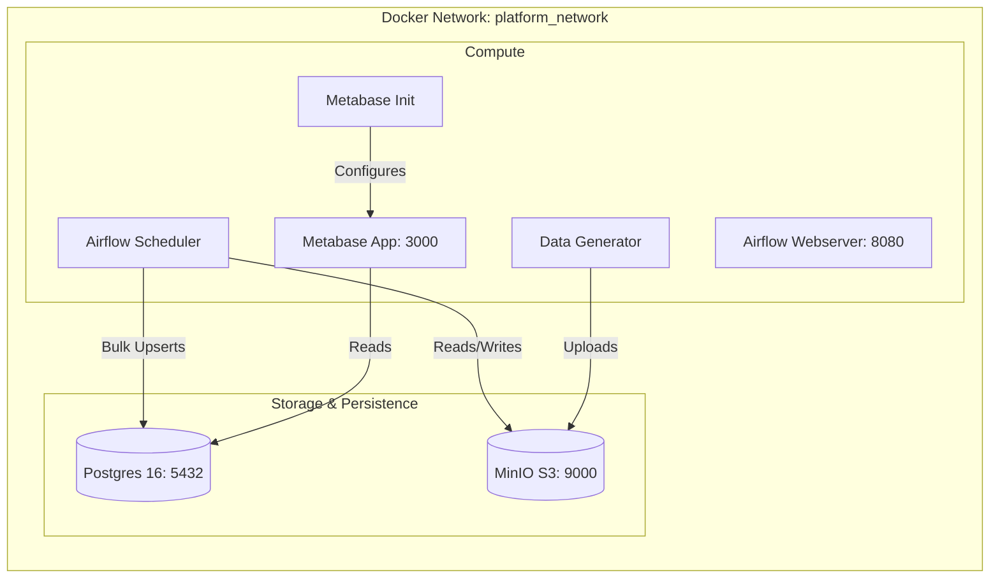
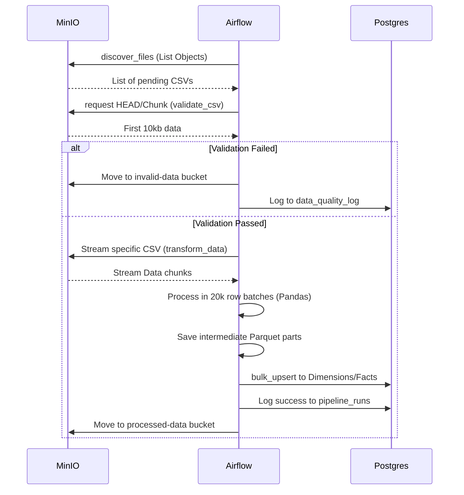

# Architecture & Data Flow

This document details the internal systems architecture and data flow of the DEM12 platform.

## 1. System Context Diagram
Shows the high-level system components and their interactions.

## 2. Containerized Component Architecture
Highlights the Docker services and internal networking.

## 3. Data Flow Execution Diagram
Details the sequence of Airflow ETL processes.

---

## Data Model

